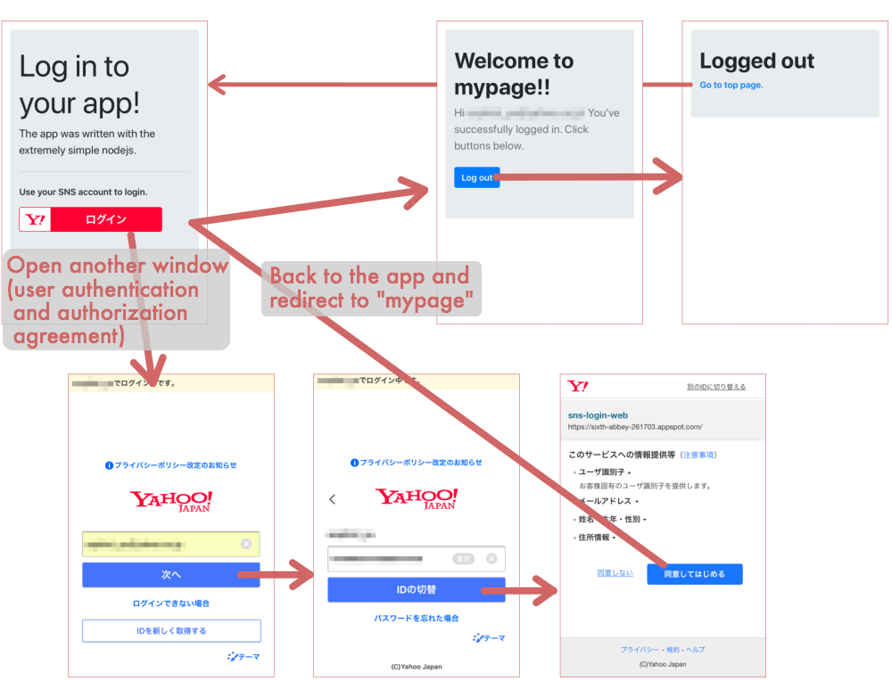

yahoo-login-web2
===

A small login authentication sample using Yahoo! ID 連携. Wanted to say "small" though it has became so complicated. It works on GCP - App Engine.



## Installation

```bash
npm install
```

### env_variables.yaml

This project requires making env_variables.yaml manually. Create an appropriate yaml like below.

```yaml
# Not let git to include environment variables.
# Separate them from app.yaml and gitignore them.
env_variables:
  YAHOO_CLIENT_ID: 'aaaaaaaaaaaaaaabbbbbbbbbbbbcccccccccccccccddddddddddddd-'
  YAHOO_CLIENT_SECRET: 'eeeeeeeeeeeeeffffffffffffffffggggggggggg'
  SESSION_MAX_AGE_MS: 60000
```
